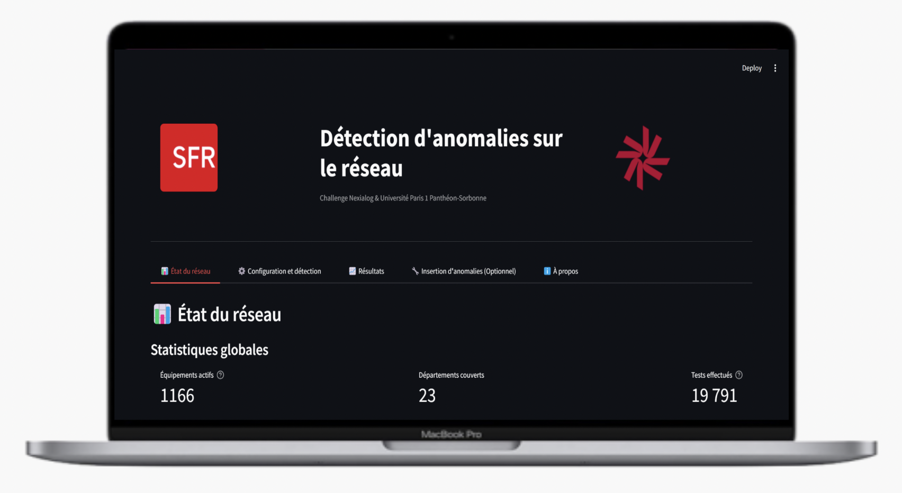

# Détection d'Anomalies Réseau SFR

Ce projet est une application de détection d'anomalies pour le réseau SFR, développée dans le cadre du Challenge Nexialog & Université Paris 1 Panthéon-Sorbonne. L'application permet d'anticiper les problèmes réseau avant qu'ils n'impactent les clients, en utilisant des techniques avancées de détection d'anomalies sur les données de tests réseau.



## Fonctionnalités

- **Analyse de l'état du réseau** : Visualisation des statistiques globales, indicateurs de performance et de santé du réseau
- **Configuration de la détection** : Paramétrage des seuils et sélection des méthodes de détection
- **Approche multi-méthodes** : Combinaison de trois approches complémentaires de détection d'anomalies
- **Visualisation des résultats** : Présentation intuitive des anomalies détectées avec leur gravité et impact

## Méthodes de détection implémentées

1. **Approche unidimensionnelle**
  - Filtrage Hodrick-Prescott pour isoler les cycles dans chaque métrique
  - Estimation de la distribution empirique via kernel density estimation (KDE)
  - Calcul de p-values pour évaluer la significativité des anomalies
  - Test de Fisher pour combiner les p-values par nœud

2. **Isolation Forest**
  - Algorithme multidimensionnel pour détecter les points atypiques
  - Détection basée sur la facilité d'isoler une observation
  - Efficace sans hypothèse préalable sur la distribution des données

3. **Distance de Mahalanobis**
  - Méthode statistique robuste avec estimateur MCD (Minimum Covariance Determinant)
  - Mesure de l'éloignement des observations par rapport à la distribution multivariée
  - Prise en compte des corrélations entre les variables

## Architecture du code

- `interface_chahla.py` : Application Streamlit principale
- `anomaly_detection_one_dim.py` : Implémentation de la détection unidimensionnelle
- `anomaly_detection_isolation_forest.py` : Implémentation de l'algorithme Isolation Forest
- `anomaly_detection_mahalanobis.py` : Implémentation de la méthode Mahalanobis
- `nodes_checker.py` : Classe pour l'analyse des anomalies par nœud
- `graph_creator.py` : Utilitaires pour la création de graphiques
- `utils.py` : Fonctions utilitaires diverses

## Installation

1. Cloner ce repo:
```bash
git clone https://github.com/votre-username/detection-anomalies-sfr.git
cd detection-anomalies-sfr
```
2. Créer un environnement virtuel et installer les dépendances:
```bash
python -m venv .sfrenv
source .sfrenv/bin/activate  # Sur Windows: .sfrenv\Scripts\activate
pip install -r requirements.txt
```
3. Lancer l'application:
``` bash
streamlit run interface_chahla.py
```

## Structure des données

L'application utilise deux types de données:
- Les données de test réseau actuel (CSV)
- Les distributions historiques des tests pour chaque nœud (JSON)

## Utilisation

1. Explorer l'état du réseau dans le premier onglet
2. Configurer les paramètres de détection dans le second onglet
3. Analyser les résultats de détection dans le troisième onglet
4. Simuler des anomalies dans le quatrième onglet

## Technologies utilisées

- Python 3.9+
- Streamlit pour l'interface utilisateur
- Pandas pour la manipulation des données
- NumPy et SciPy pour les calculs scientifiques
- Plotly pour les visualisations interactives
- Scikit-learn pour les modèles d'apprentissage automatique

## Auteurs

- Chahla Tarmoun
- Louis Lebreton
- Alexis Christien
- Issame Abdeljalil

Projet réalisé dans le cadre du Master MOSEF de l'Université Paris 1 Panthéon-Sorbonne, en partenariat avec Nexialog et SFR.

